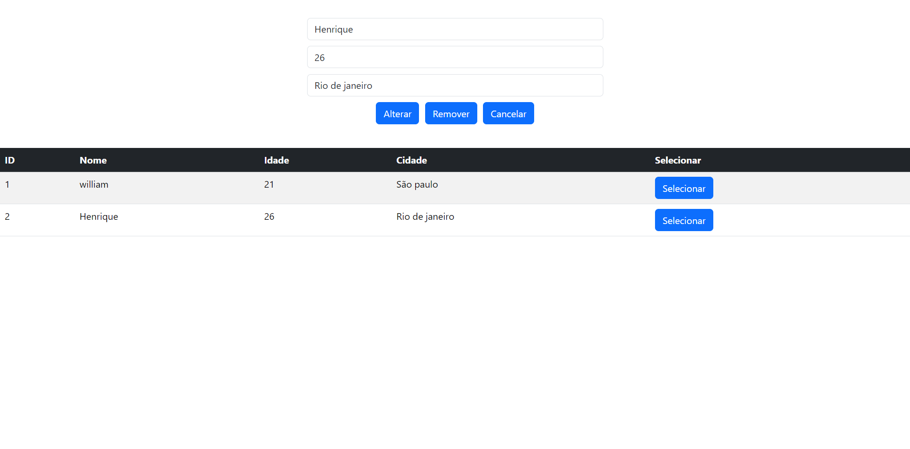
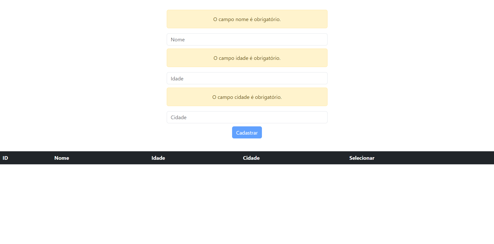
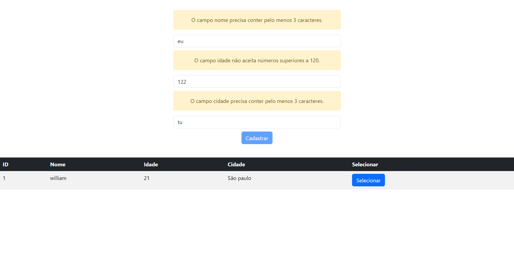

# Projeto de Cadastro com Angular e Bootstrap

Este projeto é um sistema de cadastro simples desenvolvido com Angular e Bootstrap, que permite cadastrar, alterar e remover registros de pessoas. Ele utiliza `ReactiveForms` para validação de formulários e `Bootstrap` para o design responsivo e estilização.

## Índice

- [Pré-requisitos](#pré-requisitos)
- [Imagens do Projeto](#imagens-do-projeto)
- [Como Usar](#como-usar)
- [Validações](#validações)
- [Funcionalidades](#funcionalidades)
- [Tecnologias Utilizadas](#tecnologias-utilizadas)
- [Contato](#contato)
- [Licença](#licença)

---

## Pré-requisitos

Certifique-se de ter as seguintes ferramentas instaladas no seu sistema:

- [Node.js](https://nodejs.org/) (versão 20.18.0 ou superior)
- [Angular CLI](https://angular.io/cli)
- [Git](https://git-scm.com/)
- Um editor de texto como [VS Code](https://code.visualstudio.com/)

## Imagens do Projeto

Aqui estão algumas imagens da interface e funcionamento do projeto:

*Cadastrando cliente*

*Erro de campos vazios*

*Erro de requisitos inválidos*

## Como Usar

O projeto contém um formulário para cadastro de pessoas com os seguintes campos:

- **Nome** (mínimo 3 caracteres)
- **Idade** (mínimo: 0, máximo: 120)
- **Cidade** (mínimo 3 caracteres)

### Ações do CRUD:

- **Cadastrar**: Insere um novo registro no sistema.
- **Selecionar**: Permite selecionar um registro existente para edição ou remoção.
- **Alterar**: Atualiza o registro selecionado com novos valores.
- **Remover**: Remove o registro selecionado.
- **Cancelar**: Limpa o formulário e retorna ao estado inicial de cadastro.

## Validações

### Nome:
- **Obrigatório**: O campo nome é obrigatório.
- **Mínimo de 3 caracteres**: O campo nome precisa conter pelo menos 3 caracteres.

### Idade:
- **Obrigatório**: O campo idade é obrigatório.
- **Mínimo de 0**: O campo idade não aceita números inferiores a 0.
- **Máximo de 120**: O campo idade não aceita números superiores a 120.

### Cidade:
- **Obrigatório**: O campo cidade é obrigatório.
- **Mínimo de 3 caracteres**: O campo cidade precisa conter pelo menos 3 caracteres.

## Funcionalidades

- **Formulário dinâmico**: O formulário é gerenciado com `ReactiveForms` do Angular e contém validações de campos.
- **CRUD Completo**: O projeto implementa todas as operações do CRUD (Create, Read, Update, Delete).
- **Bootstrap para Responsividade**: O design da aplicação é responsivo e foi construído usando Bootstrap 5.
- **Feedback ao Usuário**: Mensagens de erro são exibidas ao usuário quando os campos do formulário não atendem aos critérios de validação.

## Tecnologias Utilizadas

- **Angular**: Framework JavaScript para construir interfaces web dinâmicas.
- **Bootstrap**: Framework CSS para criar layouts responsivos.
- **TypeScript**: Linguagem de programação usada com Angular.
- **ReactiveForms**: Utilizado para criar e validar formulários dinâmicos em Angular.

## Contato

Criado por: **William araujo**  
Entre em contato:

[Email](williamaraujodossantos@gmail.com)
[LinkedIn](https://www.linkedin.com/in/william-araujo-3a6680256/)
[GitHub](https://github.com/william3002)

## Licença

Este projeto está sob a licença MIT. Veja o arquivo [LICENSE](LICENSE) para mais detalhes.
